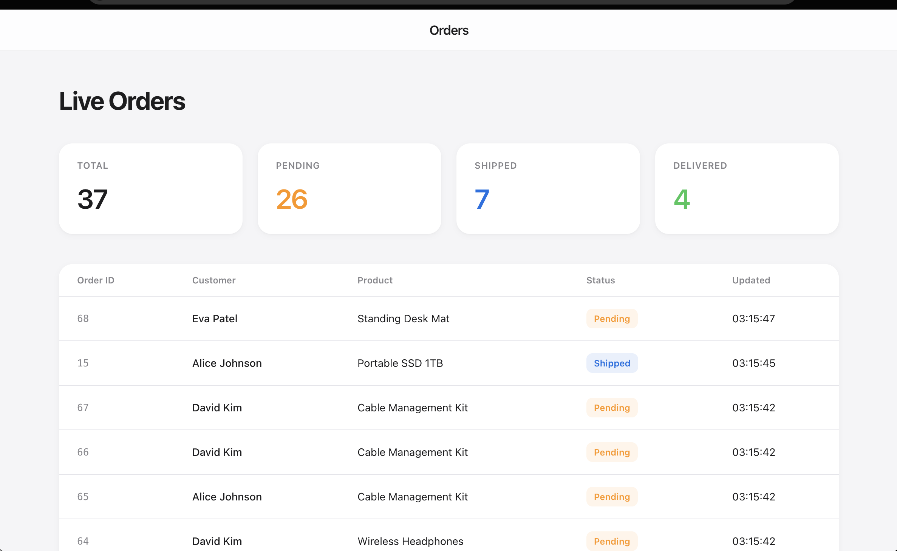
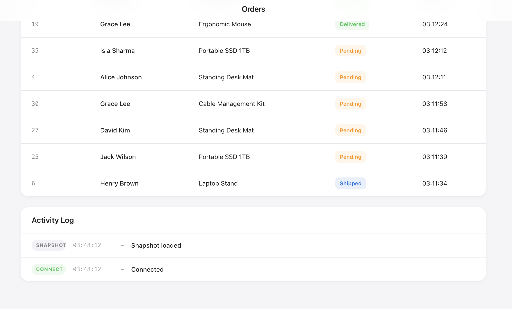
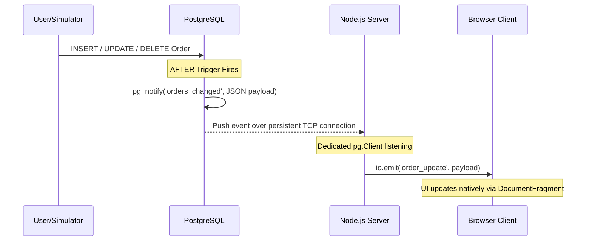

# Real-Time Order Tracking Architecture

An enterprise-grade, event-driven dashboard that streams database changes directly to the frontend instantly, completely eliminating the need for wasteful database polling.

## Dashboard Preview





## The Problem and Our Solution

**The Problem:** Traditional dashboards rely on HTTP Polling (asking the database "Are there any updates?" every few seconds). This approach burns CPU cycles, wastes bandwidth, and scales incredibly poorly as concurrent users grow.

**The Solution:** This architecture flips the model. Instead of the server asking for data, the database pushes the data exactly when a change happens. We achieve sub-millisecond latency using PostgreSQL's native LISTEN/NOTIFY pub/sub system.

### System Architecture



1. **The Trigger:** Any INSERT, UPDATE, or DELETE on the orders table triggers a custom PL/pgSQL function.
2. **The Notification:** The database securely wraps the new row data into a JSON payload and broadcasts it via pg_notify.
3. **The Listener:** A dedicated Node.js pg.Client maintains a persistent connection to the database, listening to the orders_changed channel.
4. **The WebSocket:** The Node.js server instantly relays this payload to all connected clients via Socket.io.
5. **The Frontend:** The DOM updates natively using DocumentFragment to ensure 60fps rendering without jank or layout thrashing.

## Key Engineering Decisions

- **Zero Polling:** True event-driven architecture. The database acts as the single source of truth.
- **Graceful Shutdown:** The server intercepts SIGTERM/SIGINT signals to elegantly drain WebSockets and release database handles before terminating.
- **XSS Immunity:** The frontend completely bypasses innerHTML, utilizing document.createElement exclusively to guarantee safety against injection attacks.
- **DOM Batching:** Initial data snapshots use DocumentFragment to batch render up to 100 rows in a single browser repaint cycle.
- **Session Pooler Compatibility:** Configured to work seamlessly with Supabase's IPv4 session poolers.

## Tech Stack

- **Frontend:** Vanilla JavaScript, HTML5, CSS3 (Native iOS-inspired Design System)
- **Backend:** Node.js, Express.js, Socket.io
- **Database:** PostgreSQL (Supabase)

## Quick Start

### 1. Clone and Install
```bash
git clone <your-repo-url>
cd realtime-orders
npm install
```

### 2. Configure Environment
Create a .env file from the template:
```bash
cp .env.example .env
```
Add your PostgreSQL Connection String (must be port 5432 for Session Pooler compatibility):
```env
DATABASE_URL=postgresql://postgres:<password>@db.<ref>.supabase.co:5432/postgres
PORT=3000
```

### 3. Database Initialization
Execute the schema.sql file in your Supabase SQL editor to create the necessary tables and trigger functions.

### 4. Start the Application
Run the backend server:
```bash
npm run dev
```
Visit http://localhost:3000 to view the dashboard.

### 5. Run the Real-Time Simulator
To see the system in action, open a second terminal and run the traffic simulator:
```bash
npm run simulate
```
This script autonomously mimics organic traffic, generating random orders, status updates, and cancellations every 1-2 seconds.
